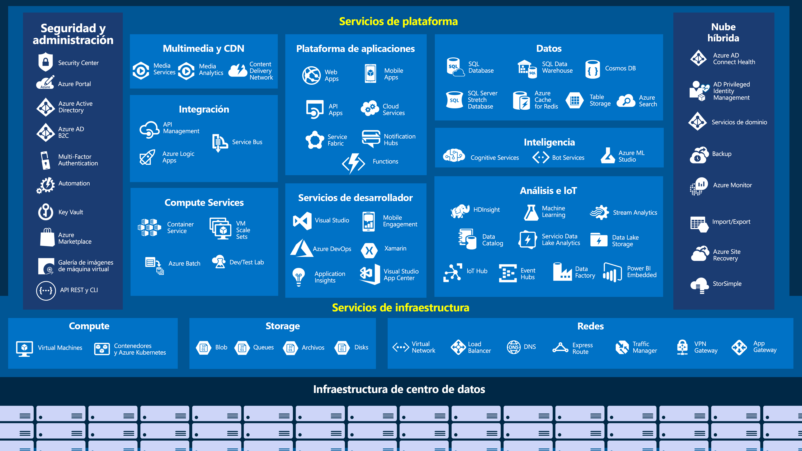

# Microsoft Learn

Hold all the labs provides from https://docs.microsoft.com/en-us/learn/ Microsoft Learn Platform.

## Cosmos db app [**_cosmos-db-app_**](cosmos-db-app)

This folder hold the lab Cosmos db in vs code https://docs.microsoft.com/es-es/learn/modules/build-cosmos-db-app-with-vscode/

## Redis cache APP [**_redis-cache_**](redis-cache)

This folder hold the lab Redis Cache https://docs.microsoft.com/es-es/learn/modules/optimize-your-web-apps-with-redis/

## Azure Functions [**_azure-functions_**](azure-functions)

This folder hold the lab https://docs.microsoft.com/es-es/learn/modules/create-serverless-logic-with-azure-functions/

## Web API Asp Core [**_web-api-core_**](web-api-core)

This folder hold the lab https://docs.microsoft.com/es-es/learn/modules/build-web-api-net-core/

## Swagger with APIs [**_swagger_**](swagger)

This folder hold the lab https://docs.microsoft.com/es-es/learn/modules/improve-api-developer-experience-with-swagger/

## Razor with ASP Core [**_razor-pages_**](razor-pages)

This folder hold the lab https://docs.microsoft.com/es-es/learn/modules/create-razor-pages-aspnet-core/

## User-Secrets [**_user-secrets_**](user-secrets)

The practic lab from the official Microsoft web page to apply secrets in the configuration seccitions.
The documentation original was privided from https://docs.microsoft.com/en-us/aspnet/core/security/app-secrets?view=aspnetcore-3.1&tabs=windows

## Blazor [**_bluild-blazor_**](bluild-blazor)

Practic lab to execute a simple calculator with blazor https://docs.microsoft.com/es-es/learn/modules/build-blazor-webassembly-visual-studio-code/ and Blazor Official PDF Document

## Webjobs [**_webjobs_**](webjobs)

Practic to deploy a webjob in azure app aplication https://docs.microsoft.com/es-es/learn/modules/run-web-app-background-task-with-webjobs/

## MVVMSample [**_mvvm-asp-core_**](mvvm-asp-core)

Practice lab from CODEM Code Magazine, Apply a MVVM Pattern at asp-core project

## Service Bus [**_service-bus_**](service-bus)

Practice lab to create a simple service bus integration https://docs.microsoft.com/en-us/learn/modules/implement-message-workflows-with-service-bus/

## Azure Queue storage [**_azure-queue-storage_**](azure-queue-storage)

Practice lab to create a queue storage https://docs.microsoft.com/en-us/learn/modules/communicate-between-apps-with-azure-queue-storage/

## TailWind with ASP-CORE [**_tailwind-asp_**](tailwind-asp)

Practice lab from https://khalidabuhakmeh.com/install-tailwind-css-with-aspnet-core to create an asp-core mvc project with tailwind css framework.

## Minimal API Design with .NET 6 [**_minimal-api_**](minimal-api)

Practice lab form https://docs.microsoft.com/en-us/aspnet/core/tutorials/min-web-api?view=aspnetcore-6.0&tabs=visual-studio to create an minimal api back end using .Net 6
Practice lab form https://docs.microsoft.com/en-us/aspnet/core/tutorials/web-api-javascript?view=aspnetcore-6.0 to consume an minimal api back end using javascript

## Api with Dapper [**_dapper-webapi_**](dapper-webapi)

Practice lab to use Dapper Minimal ORM implementing in a simple API
Lab from this video https://www.youtube.com/watch?v=OYbf9XGXgzA

## Supermarket Blazor App [**_supermarket-management_**](supermarket-management)

Practice solution to make a simple supermarket management system build with blazor.
The original YouTube Tutorial you cand find in the next link https://www.youtube.com/watch?v=DWrH7br4DsM&t=18393s

## Blazor Material UI [**_blazor-material-ui_**](blazor-material-ui)

Practice Tutorial to apply Materialized UI design with blazor and MudBlazor framework. 
The original article you cand find in the next links: 
* https://code-maze.com/blazor-material-ui-configuration-and-theme-customization/
* https://code-maze.com/creating-blazor-material-navigation-menu/
* https://code-maze.com/blazor-material-table-paging-searching-sorting/
* https://code-maze.com/using-mudblazor-to-create-product-details-page/
* https://code-maze.com/blazor-material-form-creation-with-file-upload-and-dialogs/

## AngularJS Youtube tutorial by (codigofacilito.com) [**_angular-js_**](angular-js)

This repo hold all the code replicated in the tutorial provided by codigofacilito.com to learn the principle concepts to Angular JS
The original YouTube Tutorial link cand find in https://www.youtube.com/watch?v=U4ejmeEals0&list=PLpOqH6AE0tNhdnOl1mOBthj4C7OHdwQB2

## Building a SPA Framework Using AngularJS (Pluralsigh.com) [**_framework-angular-js_**](framework-angular-js)

Angular Single Page Apps (SPA) Menus, dashboards, and widgets are important parts of many Angular apps. In this course, we'll build components to easily add these items to any project.
The original course you cand find in this link https://app.pluralsight.com/library/courses/building-spa-framework-angularjs/table-of-contents

# Azure Services MAP

[Azure Fundamentals](https://docs.microsoft.com/es-es/learn/paths/azure-fundamentals/)
